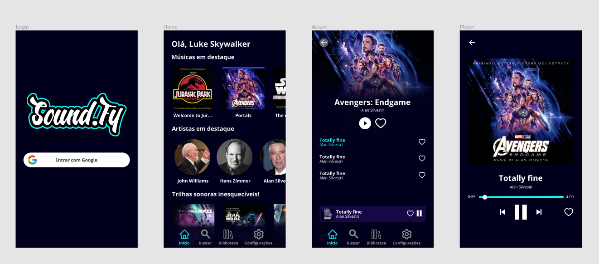

<h1 align="center">
<br>
  
<br>
<br>
<b>
Soundfy
</b>
</h1>

<p align="center">
Aplicativo desenvolvido com o proposito de aprender como manipular o player música do Android utilizando React Native.
</p>

# 📋 Índice

- [Telas](#-Telas)
- [Sobre o projeto](#-Sobre-o-projeto)
  - [Funcionalidades](#-Funcionalidades)
- [Tecnologias utilizadas](#-Tecnologias-utilizadas)
- [Rodando o projeto](#-Rodando-o-projeto)
  - [Pré-requisitos](#-Pré-requisitos)
  - [Rodando a auth-api](#-Rodando-o-app)

## 🎨 Telas


<h5>Telas do projeto representadas no <a href="https://www.figma.com/file/k8KApRZDxasA7fKrTaTRlL/Sound.Fy?node-id=0%3A1" target="_blank">Figma</a></h5>

## 📃 Sobre o projeto

O Soundfy é um projeto desenvolvido para entender como o player de música do Android funciona utilizando React Native e outras técnologias relacionadas.

A ideia de utilizar trilhas sonoras de filmes famosos veio através do meu gosto por escutar algumas dessas músicas enquanto programo, as músicas tem apenas 31 segundos de demonstração porque não estão salvas localmente ou em algum serviço desenvolvido por mim, o link das demonstrações em mp3 aponta para links do deezer.

### 🎶 Funcionalidades

- Fazer login através de uma conta Google
- Tocar músicas mp3 que apontam para URLs no deezer
- Avançar ou retroceder músicas em destaque
- Salvar músicas e albuns favoritos

## 🛠 Tecnologias utilizadas

- ⚛ **React Native** - Aplicativo
- 🛳️ **React Navigation** - Navegação
- ⚛ **Redux Toolkit** - Gerenciamento de estado
- 🔥 **React Native Firebase** - Comunicação com o Firebase
- 🎇 **Lottie** Animações
- 🎸 **React Native Track Player** - Controle do player de áudio
- 💅 **Styled Components** - Estilização

## 🚀 Rodando o projeto

Antes de rodar a aplicação é necessário criar um projeto no Firebase, ativar a autenticação com o Google e gerar um <b>ID do cliente da Web</b>, após isso crie um arquivo chamado <b>.env</b> na pasta raiz do projeto, adicione o campo `FIREBASE_WEB_CLIENT_ID` com o o Id do cliente da Web gerado por você no firebase.

### Pré-requisitos

- Git
- Yarn
- Conhecimento prévio de como rodar projetos com React Native

### 📲 Rodando o app

Com a máquina devidamente configurada para rodar projetos com React Native, clone o repositório

```bash

# Clona o repositório
git clone https://github.com/thiagosprestes/Spotify-clone-app-react.git

```

Navegue até a pasta do projeto clonado e execute os comandos abaixo

```bash

# Entra na pasta do app
cd soundfy

# Instala as dependências
yarn

```

Após concluir a instalação das dependências, ainda no terminal da pasta do app com o emulador aberto ou device físico conectado via adb execute o comando abaixo

```bash

# Instala a aplicação no device
yarn android

```

Após concluir a instalação do App, execute o seguinte comando para executar o app

```bash

# Inicia a aplicação
yarn start

```
